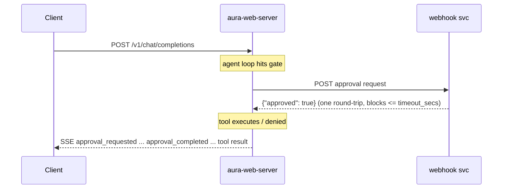
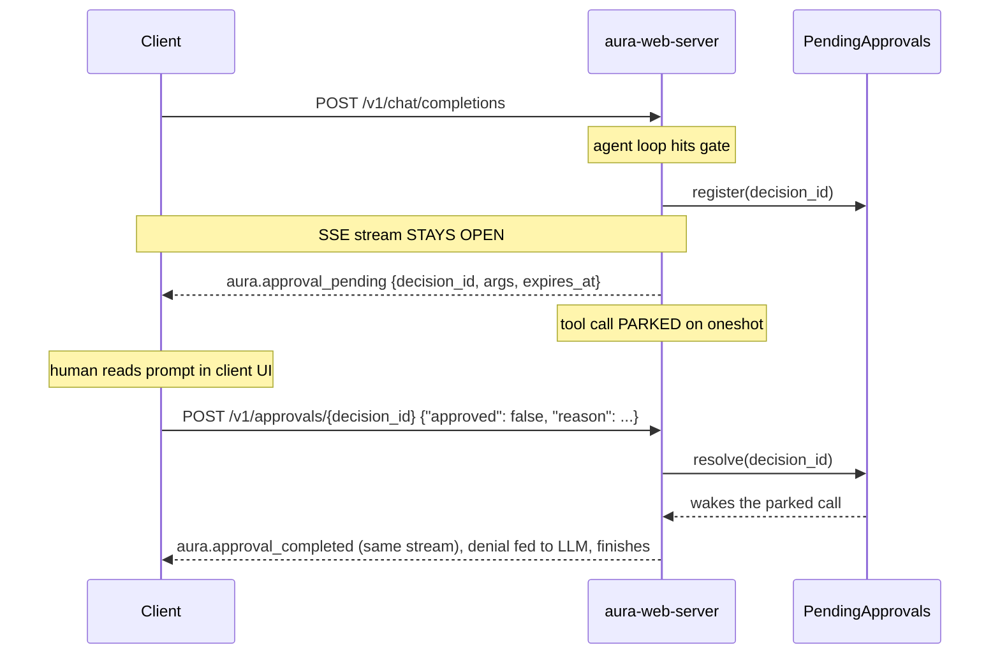
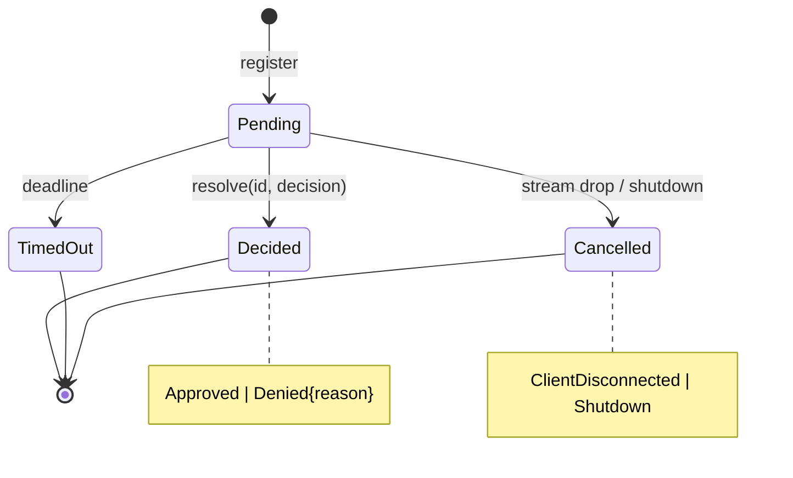

<!-- markdownlint-disable MD033 -->
# HITL approval: design and implementation note

Companion to the ADR [2026-06-16-hitl-approval-architecture](../adr/2026-06-16-hitl-approval-architecture.md).
The ADR records the decision (dual-channel routing chosen by config, fail-closed,
per-process registry with named boundaries). This note carries the type-level
design, the module layout, the config and wire formats, and a keep / rework /
discard map over the spike on `mshearer/hitl-v1-config-gate` (@ `52f37e6`).

**Status:** living design note, current as of 2026-06-23. The ADR holds the
durable decision. This note follows the code, so parts of it go stale; the
anchors below make the staleness checkable.

Both routes (webhook and conversational) are fully operational in single-agent
and orchestration mode. Single-agent wiring lives in `Agent::new`
(`crates/aura/src/builder.rs`); orchestration wiring in `create_worker`
(`crates/aura/src/orchestration/orchestrator.rs`). CLI standalone resolves
conversational approvals in-process via `PendingApprovals::resolve()` instead
of `POST /v1/approvals/{id}`.

- Spike references (`mshearer/hitl-v1-config-gate`) are pinned to the immutable
  revision `52f37e6` and stay valid.
- References to existing aura code (file:line, module paths) are against
  `origin/main` at `7f29f7f4` (v1.23.0) and move as the code does. Read them as
  where-to-look pointers, not current coordinates.
- The Rust signatures and diagrams below describe intended design, not code that
  exists yet.

## The two routes in detail

### Route A: webhook (unattended)

One synchronous HTTP round-trip. The decision comes back in the response body.



### Route B: conversational (attended)

SSE is one-way, so the open stream carries the prompt down and the decision
comes back as a separate HTTP request. The tool call parks in-process on a
oneshot channel; the original stream stays open the whole time.



The pending approval lasts exactly as long as that SSE connection. A dropped
stream denies the approval and fails the call closed. Durable park-and-resume
(the stream closes, then a later decision resumes the run from a checkpoint) is
the [#209](https://github.com/mezmo/aura/issues/209)-gated successor.

### Route B': the turn-ending tool cycle, where it reaches

The standard conversational approval pattern ends the turn instead of holding it
open: the model emits a tool call, the stream closes with
`finish_reason: "tool_calls"`, the client runs the tool (and asks the human), and
the decision returns as a tool-result message in the next request.

Aura already runs this cycle for client-side tools. Advertised tools register as
passthrough tools whose marker result ends the stream with
`finish_reason: "tool_calls"` (`crates/aura-web-server/src/streaming/handlers.rs:848-855`);
the CLI executes locally and re-POSTs the full history with the tool result; the
stateless server resumes the loop from history
(`crates/aura-web-server/src/handlers.rs:835`). The agent-requested approval
surface rides this path unchanged: when a single-agent client advertises a
`request_approval` tool, approval is just a client tool, so any
OpenAI-compatible consumer with function calling can be an approver. See
"Approval tool attachment".

The ADR explains why this cycle cannot serve the config gate (the client would
hold approved arguments across the turn boundary) or orchestration (ending the
top-level turn mid-worker is durable parking). The design consequences here are
concrete. The gate keeps the parked call in the in-memory registry, beyond the
reach of any client-side tampering between approval and execution. Orchestration
already drops client tools, and its workers are nested server-side agent loops.
With no client to run a passthrough approval tool there, the held-open stream is
the only attended option.

When [#209](https://github.com/mezmo/aura/issues/209) and the
[#191](https://github.com/mezmo/aura/issues/191) binding land, the gate and
orchestration can converge onto the turn-ending cycle too; the `DecisionId` and
ingress endpoint carry over unchanged, and what changes is where the park lives.

## Approval tool attachment

The agent-requested surface resolves by capability advertisement, the same
precedent as `--enable-client-tools`:

- A single-agent request whose client advertises a `request_approval` tool: the
  client's tool is attached (passthrough, turn-ending cycle). The server-side
  `RequestApprovalTool` is not attached; the approval happens client-side and no
  registry entry exists.
- Otherwise: the server-side `RequestApprovalTool` is attached and dispatches
  through the configured `DecisionRoute`.

Advertising the tool is the attendance signal for this surface. The config gate
ignores the advertisement and always uses `DecisionRoute`. The server still emits
`approval_requested` / `approval_completed` events around client-side approvals
for observability parity.

## Approval lifecycle as a state machine



```rust
pub enum ApprovalDecision { Approved, Denied { reason: Option<String> } }

pub enum ApprovalOutcome {
    Decided(ApprovalDecision),
    TimedOut { waited: Duration },
    Cancelled(CancelReason),        // ClientDisconnected | Shutdown
}
```

`ApprovalOutcome` has three variants but four logical terminal states, because
`Decided` carries the `Approved` / `Denied` split. Only `Decided(Approved)`
executes the gated call; `Denied`, `TimedOut`, and `Cancelled` all deny. That is
the type-level form of the fail-closed decision the ADR records. Timeout and
disconnect stay distinct from a human denial because they emit different events
and carry different retry semantics.

`ApprovalOutcome` models terminal states only. Pending is not a variant: the
pending state is the suspended await itself (registry entry, oneshot, open
stream), so the only operation on it is awaiting it, and a match on
`ApprovalOutcome` is always a match on a finished approval.

## Core domain types

```rust
// decision.rs -- the resolvable handle. Private field; generate()/parse() only.
// This is where #191's durable consumption/expiry semantics attach later.
// Derives Ord: UUID v7 sorts by creation time, so the registry's BTreeMap
// iterates pending approvals oldest-first.
pub struct DecisionId(Uuid);                 // Uuid::now_v7()

// decision.rs -- WHO is asking (embedded in events and the webhook payload)
pub enum AgentScope {
    Single      { session_id: Option<SessionId> },
    Worker      { run_id: RunId, task: TaskIdentity, session_id: Option<SessionId> },
    Coordinator { run_id: RunId },           // future coordinator surface, declared now
}

// decision.rs -- WHY this approval exists. Replaces the spike's RequestType plus
// the matched_pattern: Option<String> field whose Some/None tracked the surface
// by convention. Exhaustive: a WorkerEscalation branch arrives with the
// coordinator-mediated work.
pub enum ApprovalOrigin {
    ConfigGate     { matched_pattern: String },   // display form of the glob that fired
    AgentRequested { reason: String },
}

// decision.rs -- typestate for the parked call. outcome() consumes self, so a
// registration is awaited at most once; select! over rx / deadline / cancellation.
pub struct AwaitingDecision { /* id, oneshot::Receiver, deadline */ }
impl AwaitingDecision {
    pub async fn outcome(self, cancel: &CancellationToken) -> ApprovalOutcome;
}

// registry.rs -- Clone newtype over an Arc, the SharedTaskStore idiom (see
// "Where cross-request state lives"). Not a global static.
#[derive(Clone)]
pub struct PendingApprovals(Arc<PendingApprovalsInner>);

struct PendingApprovalsInner {
    // std::sync::Mutex: every operation is a synchronous map op (insert/remove/
    // oneshot send); nothing awaits while holding the lock.
    // BTreeMap keyed on DecisionId (UUID v7, time-ordered), so iteration is
    // chronological registration order: oldest pending approval first.
    entries: std::sync::Mutex<BTreeMap<DecisionId, PendingEntry>>,
}

// Each entry splits into a serialization-ready core and a runtime-only handle.
// Nothing is serialized today; the split means durable parking (#209) can persist
// ParkedApproval as-is, because it already carries everything needed to re-render
// and re-validate the approval after a restart. Deadlines are wall-clock
// Timestamps, not Instants -- an Instant is meaningless across a process restart.
struct PendingEntry {
    parked: ParkedApproval,                  // serializable when the time comes
    wake: oneshot::Sender<ApprovalDecision>, // runtime-only, never serialized
}

pub struct ParkedApproval {
    pub request: ApprovalRequest,            // decision_id, request_id, agent scope,
                                             //   origin, items -- the full payload
    pub registered_at: Timestamp,
    pub expires_at: Timestamp,
}

impl PendingApprovals {
    pub fn register(&self, request: ApprovalRequest, timeout: Duration) -> AwaitingDecision;
    pub fn resolve(&self, id: &DecisionId, d: ApprovalDecision) -> Result<(), ResolveError>;
    pub fn cancel_request(&self, request_id: &RequestId);
}

// route.rs -- closed two-variant enum. The spike's ApprovalDispatch trait is
// removed: the variant set is known, CLI standalone is just Conversational
// against its own registry, and decide() holds the shared semantics (deadline,
// fail-closed mapping, event emission) in one place instead of per-impl.
pub enum DecisionRoute {
    Conversational { registry: PendingApprovals, timeout: Duration },
    Webhook        { client: WebhookClient, timeout: Duration },
}
```

`resolve` removes the entry and the oneshot consumes itself, so a `DecisionId`
resolves at most once in-process. That is the state-free version of the
[#191](https://github.com/mezmo/aura/issues/191) exactly-once invariant; the
durable version slots in behind the same type.

`ApprovalRequest.request_id` is the global request id (the one used for SSE
routing and MCP cancellation). The spike's two per-call `Uuid::new_v4()` sites
(`crates/aura/src/hitl.rs:402`, `:534` on `52f37e6`) are deleted.

## Where cross-request state lives

`PendingApprovals` is the first mutable state on the chat path that crosses
request boundaries: an approval is registered during one request's stream and
resolved by a `POST /v1/approvals/{id}` that arrives as a different request. The
existing chat-path registries do not cross requests; the cancellation registry
and the tool event broker register and consume within a single request's
lifecycle (their global statics solve Rig's thread-jumping, not request-crossing).

The in-tree precedent for request-crossing state is the A2A server:
`SharedTaskStore(Arc<InMemoryTaskStore>)` is a `Clone` newtype over an `Arc`,
constructed once in `main` and captured by the request handler, and
`task_cancel_state: Arc<Mutex<HashMap<..>>>` in `AuraAgentExecutor` lets a
`tasks/cancel` request mutate state created by an earlier `message:send`.

`PendingApprovals` follows the same shape and lives on `AppState`
(`crates/aura-web-server/src/types.rs:77`), because both chat-path handlers that
touch it already receive `State<Arc<AppState>>`:

```rust
// aura-web-server/src/types.rs
pub struct AppState {
    // ... existing fields unchanged ...
    /// Cross-request HITL state: approvals parked by a streaming request,
    /// resolved by POST /v1/approvals/{decision_id} on a later request.
    /// Per-process; a decision must land on the pod that parked the call.
    pub pending_approvals: PendingApprovals,
}
```

Flow of ownership: `main` constructs one `PendingApprovals`, stores it on
`AppState`, and the completions handler clones it into the per-request build
context (`AgentRuntimeConfig`, the type [PR #201](https://github.com/mezmo/aura/pull/201)
renamed from the old `AgentConfig`), alongside the `request_id`. The
builder/orchestrator construct `DecisionRoute::Conversational` with it, and the
ingress handler resolves through the same instance via `State`. The CLI in
standalone mode constructs its own instance. If A2A grows HITL support, the
executor receives a clone of the same instance: one process, one registry. No
global static is added.

## Crate boundary is a DTO pattern

HITL types need an ownership rule across crates. The spike left `RequestType` and
`ApprovalDecision` in `aura-events` (an SSE wire crate) while the logic that owns
them lives in `aura`. Since the spike was written,
[PR #201](https://github.com/mezmo/aura/pull/201) (`537dcb9d`,
[#174](https://github.com/mezmo/aura/issues/174)) inverted the
aura / aura-config dependency, so the parse-time config types now have a natural
home. The rule:

- **`aura::hitl` owns the domain.** `AgentScope`, `ApprovalDecision`,
  `ApprovalOutcome`, `DecisionId`, `ApprovalOrigin`, `Timestamp` are defined
  there. Domain logic never imports its core types from `aura-events`.
- **`aura-events` is a serde-only DTO layer**: mirror structs for SSE events with
  string ids and RFC3339 timestamps, no behavior. `ApprovalDecisionWire` already
  follows this pattern; this applies it consistently.
- **`aura::hitl::events` is the single conversion boundary**
  (`impl From<&domain> for aura_events::XWire`). It is the only file that imports both worlds.
- **Parse-time config types** (`HitlConfig`, `DecisionRouteConfig`, `WebhookUrl`,
  `GlobPattern`) are defined directly in `aura-config`, alongside the other TOML
  tables that moved there in PR #201 (near `AgentSettings` in
  `crates/aura-config/src/config.rs`). When the spike was written the dependency
  pointed the other way and these types could only live in `aura`; PR #201
  inverted it, so `aura-config` is now their home with no indirection.

The cost is mirror-struct duplication. The benefit is that the domain can evolve
without touching the wire crate, and clients consume DTOs that never carry domain
behavior.

## Module tree

The spike's `crates/aura/src/hitl.rs` is a single 831-line module (@ `52f37e6`)
holding the webhook wire structs, the HTTP client, the tool wrapper, the agent
tool, and event emission. It splits:

```text
crates/aura/src/hitl/
|-- mod.rs        // facade: pub use the public surface, nothing else
|-- protocol.rs   // webhook wire: ApprovalRequest, ApprovalItem, version const
|-- decision.rs   // domain core: DecisionId, ApprovalDecision, ApprovalOutcome,
|                 //   ApprovalOrigin, AgentScope, CancelReason, AwaitingDecision
|-- registry.rs   // PendingApprovals, PendingEntry, ResolveError
|-- route.rs      // DecisionRoute + webhook client
|-- events.rs     // From<&domain> for aura_events DTOs (only file importing both)
|-- gate.rs       // HitlApprovalWrapper (config-gate surface)
`-- tool.rs       // RequestApprovalTool (agent-callable surface)
```

The config types (`HitlConfig`, `DecisionRouteConfig`, `WebhookUrl`,
`GlobPattern`) live in `aura-config`, not in this tree, per the crate boundary above.

## Config schema

```toml
[hitl]
require_approval = ["kubectl_*", "restart_*"]

[hitl.route]
mode = "conversational"      # or: mode = "webhook", url = "https://..."
timeout_secs = 300           # per-route defaults differ
```

```rust
pub struct HitlConfig {
    #[serde(default)]
    pub require_approval: Vec<GlobPattern>,    // pre-compiled globset at TOML load
    pub route: DecisionRouteConfig,            // required when [hitl] is present
}

#[serde(tag = "mode", rename_all = "snake_case")]
pub enum DecisionRouteConfig {
    Conversational { timeout_secs: u64 },            // default 60: the approver is
                                                     //   already at the client
    Webhook { url: WebhookUrl, timeout_secs: u64 },  // default 300: the webhook may
                                                     //   page a human or route
                                                     //   through chat ops
}
```

`Option<HitlConfig>` on `Config` remains the enable bit; there is no `enabled`
bool. The "webhook_url required, never empty" invariant holds structurally: the
`Webhook` variant cannot parse without a valid URL. The `matched_pattern` on the
wire is the original pattern string, so `GlobPattern` keeps its source text
alongside the compiled matcher. The hand-rolled `glob_match` in the spike is
replaced by `globset`, compiled at TOML load.

Config validation warns when either route's timeout is greater than or equal to
`per_call_timeout_secs` in orchestration mode: a parked tool call that outlives
its task budget gets killed by the wrong mechanism.

## SSE events and the decision ingress

```rust
// aura-events DTOs
ApprovalRequested { decision_id, tool_name, origin, scope }
ApprovalPending   { decision_id, tool_name, arguments, origin, scope, expires_at }
ApprovalCompleted { decision_id, outcome, duration_ms, scope }   // outcome includes
                                                                 // timeout/cancelled
```

`aura.approval_pending` emits only on the conversational route. It is the
attended prompt: `decision_id` is the resolution handle, `expires_at` lets a
client render a countdown. The webhook route keeps the requested/completed pair.

```text
POST /v1/approvals/{decision_id}
body: { "approved": true } | { "approved": false, "reason": "..." }
204 on success . 404 unknown/expired/already-resolved . 400 on parse
```

The body mirrors the webhook response format, so an approver service and an
attended client speak the same decision schema.

### Event gating (the AURA_CUSTOM_EVENTS interaction)

The spike published approval events through the tool event broker, which the
streaming handler only drains when custom events are enabled
(`callbacks.tool_event_rx.recv(), if emit_custom_events` at
`crates/aura-web-server/src/streaming/handlers.rs:243`). That makes the attended
prompt invisible whenever `AURA_CUSTOM_EVENTS` is off, so a parked call would
strand the operator with no prompt.

The ADR resolves this: approval events emit regardless of `AURA_CUSTOM_EVENTS`.
The implementation must not route them through the `emit_custom_events`-gated arm.
They belong on a path equivalent to the client-tool passthrough chunks, which
already reach the client ungated (`streaming/handlers.rs:848-855`), because the
attended prompt and the decision record are protocol rather than optional
telemetry.

## Orchestration behavior

Workers share the parent's request id, so `approval_pending` events from a parked
worker reach the client on the request's stream, and a decision posted to the
ingress resolves the worker's oneshot directly. Multiple workers can park
concurrently under one request id; each has its own `DecisionId`, so the registry
keys on decisions rather than requests. Single-agent mode is the degenerate case
on the same code path. The `Coordinator` scope variant and `WorkerEscalation`
origin are declared design space for future coordinator-mediated mechanisms;
neither is constructed in this work.

## Keep / rework / discard map for the spike

Verdicts against `mshearer/hitl-v1-config-gate` @ `52f37e6`.

| Spike element | Verdict | Notes |
|---|---|---|
| `HitlApprovalWrapper` gate, composed first in the chain | keep | insertion point unchanged |
| `RequestApprovalTool` surface | keep | constructs `ApprovalOrigin::AgentRequested`; attached only when the client does not advertise its own `request_approval` |
| Webhook HTTP client + fail-closed error handling | keep | becomes the `Webhook` route arm |
| `request_approval` excluded from glob matching | keep | |
| SSE routing via `tool_event_broker` + request id | keep, but ungate | approval events must reach the client regardless of `AURA_CUSTOM_EVENTS` (see event gating above) |
| Unit tests | mostly keep | assertions updated only where the compiler forces it |
| `hitl.rs` single file | rework | module tree above |
| `ApprovalRequest` / `ApprovalItem` shape | rework | `decision_id`, `origin`, scope on agent; `task` and per-item `matched_pattern` removed |
| `HitlConfig` | rework | route enum replaces `enabled` + `webhook_url`; type now lives in `aura-config` |
| Hand-rolled `glob_match` | rework | `globset`, compiled at TOML load |
| `HitlContext` | rework | carries `DecisionRoute`; constructor instead of literal struct syntax |
| Duplicated `ApprovalRequest` construction (wrapper vs tool) | rework | unified in `route.rs` |
| `ApprovalDispatch` trait + `Arc<dyn>` | discard | closed enum replaces it |
| Per-call `Uuid::new_v4()` request ids (`hitl.rs:402`, `:534`) | discard | global request id |
| `RequestType` enum | discard | `ApprovalOrigin` replaces it |
| `HitlConfig.enabled` + empty-URL checks | discard | |

## Implementation notes

- **`ToolWrapper::pre_call` is spike-only.** The async `pre_call` hook the gate
  composes on does not exist on `origin/main`'s `ToolWrapper` trait
  (`crates/aura/src/tool_wrapper.rs:179`); it was added by the spike and must be
  ported as part of the gate work.
- **Phasing** lives in [#191](https://github.com/mezmo/aura/issues/191), not here.
  The intended order is: (1) domain plus module split with the webhook arm only,
  matching the spike's behavior; (2) the conversational route, registry, ingress,
  and disconnect/shutdown cancellation; (3) attended client plus orchestration
  verification. Each phase carries a workspace build/test/clippy gate and an
  end-to-end smoke against a local mock webhook.
- **Out of scope** (tracked elsewhere): durable parking and resume, A2A
  `TaskState::InputRequired` wiring, confidence-based auto-approve, multi-webhook
  fan-out, an `Auto` route, authentication on the decision ingress, the
  coordinator-mediated approval surfaces, and the durable forms of the
  [#191](https://github.com/mezmo/aura/issues/191) binding and exactly-once
  invariants.
