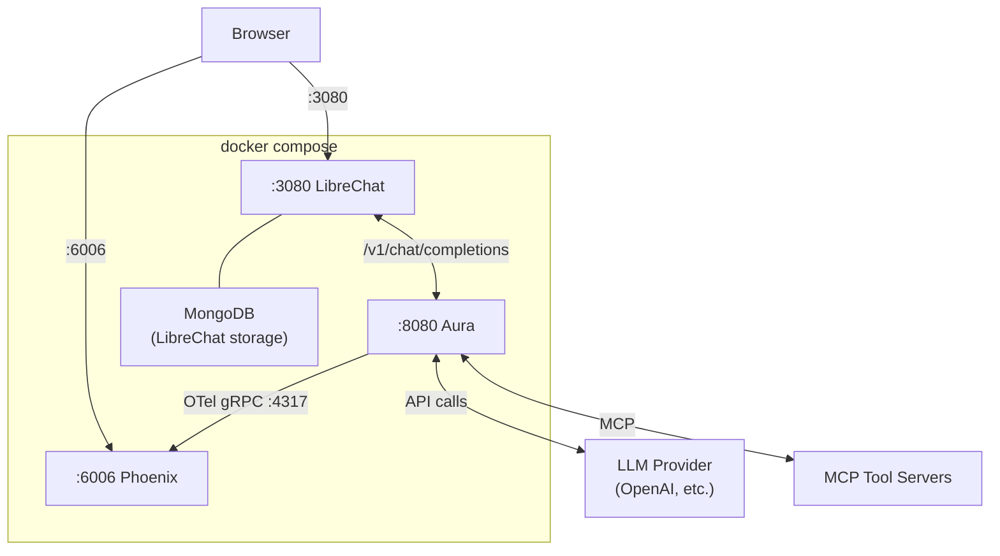

# Aura Quickstart

Get a fully working AI agent stack running in under a minute — Aura, a chat UI, and a trace viewer — all from the repo root.

**Prerequisites:** [Docker](https://docs.docker.com/get-docker/) and an LLM API key (OpenAI, Anthropic, or a local [Ollama](https://ollama.com) instance).

## 1. Configure your LLM provider

```bash
cp .env.example .env
```

Edit `.env` and set your provider, model, and API key:

```bash
LLM_PROVIDER=openai          # or: anthropic, ollama
LLM_MODEL=gpt-5.2            # or: claude-sonnet-4-20250514, llama3.1
LLM_API_KEY=sk-...            # your API key (use "unused" for Ollama/llama-server)
```

## 2. Start everything

```bash
docker compose up -d
```

## 3. Open the UIs

| Service | URL | Description |
|---------|-----|-------------|
| LibreChat | <http://localhost:3080> | Chat with your agent |
| Phoenix | <http://localhost:6006> | Inspect LLM traces |
| Aura API | <http://localhost:8080> | OpenAI-compatible API |

**LibreChat first-time setup:** Create your user account on the signup page. The agent model is pre-configured as "Aura Assistant".

> **Tip:** Check startup progress with `docker compose logs -f aura`.

### Use the CLI instead

Prefer a terminal? The [Aura CLI](../crates/aura-cli/README.md) ships in the same Docker image. Exec into the running container:

```bash
docker exec -it aura ./aura-cli
```

Or build from source and connect to the quickstart server:

```bash
cargo build -p aura-cli --release
./target/release/aura-cli
```

The CLI also supports a **standalone mode** that runs agents in-process from a TOML config — no server needed:

```bash
cargo build -p aura-cli --release --features standalone-cli
./target/release/aura-cli --standalone --config quickstart.toml
```

See the [CLI README](../crates/aura-cli/README.md) for the full feature set.

## Customize Your Agent

Edit `quickstart.toml` to change agent behavior, add tools, or enable vector search.
Edit `.env` to switch LLM providers. Then apply changes:

```bash
docker compose up -d        # picks up .env changes and recreates if needed
```

> **Note:** `docker compose restart aura` is fine for `quickstart.toml`-only changes, but
> `.env` changes require `docker compose up -d` to take effect.

### Switch LLM provider

Update `LLM_PROVIDER`, `LLM_MODEL`, and `LLM_API_KEY` in `.env`, then `docker compose up -d`.

**Anthropic:**

```bash
LLM_PROVIDER=anthropic
LLM_MODEL=claude-sonnet-4-20250514
LLM_API_KEY=sk-ant-...
```

**Ollama** (local, no API key):

```bash
LLM_PROVIDER=ollama
LLM_MODEL=llama3.1
LLM_API_KEY=unused
LLM_BASE_URL=http://host.docker.internal:11434
```

Also uncomment the `base_url` and `fallback_tool_parsing` lines in `quickstart.toml`.

**[llama-server](https://github.com/ggml-org/llama.cpp/tree/master/tools/server)** (llama.cpp, local, no API key):

llama-server exposes an OpenAI-compatible API, so use the `openai` provider with a `base_url` override:

```bash
LLM_PROVIDER=openai
LLM_MODEL=local-model
LLM_API_KEY=unused
LLM_BASE_URL=http://host.docker.internal:8080/v1
```

Also uncomment the `base_url` line in `quickstart.toml`. The `LLM_MODEL` value can be anything — llama-server ignores it and uses whatever model it was started with.

### Add MCP tool servers

Uncomment the `[mcp]` section in `quickstart.toml` and point it at your MCP server:

```toml
[mcp]
sanitize_schemas = true

[mcp.servers.my_tools]
transport = "http_streamable"
url = "http://host.docker.internal:9000/mcp"
```

Use `host.docker.internal` to reach services running on your host machine.

### Add vector search

Uncomment the `[[vector_stores]]` section in `quickstart.toml`. Options:

- **Qdrant** (self-hosted): add a Qdrant instance to the compose file or point at an external one. Embeddings can be generated via OpenAI or AWS Bedrock.
- **AWS Bedrock Knowledge Base** (managed): set `type = "bedrock_kb"` with a `knowledge_base_id` and `region`. No embedding model needed — the KB manages embeddings internally.

See [`examples/reference.toml`](../examples/reference.toml) for both.

### Serve multiple agents

Create a directory with one TOML file per agent:

```
configs/
├── research-assistant.toml
├── devops-agent.toml
└── code-reviewer.toml
```

Then update `docker-compose.yml` to mount and serve the directory:

```yaml
    environment:
      CONFIG_PATH: "/app/config/configs"
    volumes:
      - ./configs:/app/config/configs:ro
```

Restart with `docker compose up -d`. Clients that support model selection (LibreChat, OpenWebUI, etc.) will show each agent in their model picker via `GET /v1/models`.

### Enable orchestration mode

Orchestration mode routes requests through a **coordinator** that decomposes problems into tasks and dispatches them to **workers** — each with access to a filtered subset of MCP tools.

Add these sections to `quickstart.toml` (below the `[agent]` block):

```toml
[orchestration]
enabled = true
max_planning_cycles = 2
allow_direct_answers = true    # simple queries answered without workers
allow_clarification = true     # vague requests prompt follow-up questions
tools_in_planning = "summary"  # coordinator sees tool names during planning

[orchestration.worker.operations]
description = "Operational analysis and diagnostics"
preamble = """
You are an operations specialist completing one assigned task.
Use your tools for every operation — do not guess results.
"""
mcp_filter = ["ops_*"]         # glob patterns selecting which MCP tools this worker can use
turn_depth = 5

[orchestration.worker.knowledge]
description = "Documentation and knowledge retrieval"
preamble = """
You are a knowledge specialist completing one assigned task.
Search available documentation to answer the question.
"""
mcp_filter = []
vector_stores = ["docs"]       # this worker uses vector search instead of MCP tools
turn_depth = 5
```

Each worker inherits the agent's LLM by default. To run a worker on a different model, add a complete `[orchestration.worker.<name>.llm]` block — see the [orchestration config reference](../README.md#orchestration) for all fields.

Restart with `docker compose restart aura` and try asking a multi-step question. Watch the coordinator plan and dispatch in Phoenix at <http://localhost:6006>.

For a fully self-contained orchestration example with a math MCP server, see the [Orchestration — Math MCP quickstart](../examples/quickstart-orchestration-math/README.md).

### Full configuration reference

See [`examples/reference.toml`](../examples/reference.toml) for all available options.

## What's Next

Once the basic quickstart is running, try these more advanced setups:

- **[Orchestration Quickstart](../examples/quickstart-orchestration-math/README.md)** — Multi-agent orchestration with a coordinator that dispatches tasks to specialized workers. Uses a math MCP server to demonstrate parallel task execution.
- **[Kubernetes SRE Quickstart](../examples/quickstart-k8s-sre/README.md)** — Deploy an AI-powered SRE agent on a KIND cluster with real Kubernetes and Prometheus MCP servers.
- **[Example Configs](../examples/README.md)** — Minimal per-provider configs and complete agent compositions to use as starting points.

## Architecture



- **LibreChat** sends chat requests to Aura's OpenAI-compatible `/v1/chat/completions` endpoint. MongoDB is used by LibreChat internally for user accounts and conversation history — Aura does not use it.
- **Aura** calls the configured LLM provider, executes MCP tools, and streams responses back.
- **Phoenix** receives OpenTelemetry traces from Aura so you can inspect every step.

## Troubleshooting

**LibreChat shows "no models available"**
Aura may still be starting. Wait for the health check to pass (`docker compose logs aura --tail 5`) and refresh.

**"connection refused" in Aura logs**
If referencing services on your host, use `host.docker.internal` instead of `localhost` in `quickstart.toml`.

**Reset everything**

```bash
docker compose down -v
```
